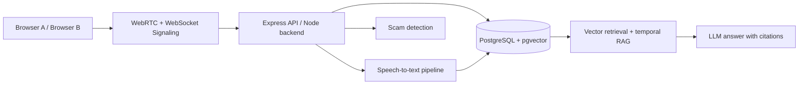

# CallMind

## Quick Run Commands

### Run with Docker (Recommended)
```bash
# Copy environment file
cp .env.example .env

# Start all services
docker-compose up --build
```

Then open your browser to `http://localhost:5173`

### Run Locally (without Docker)
```bash
# Terminal 1 - Start Backend
cd backend
npm install
npm start

# Terminal 2 - Start Frontend (in a new terminal)
cd frontend
npm install
npm run dev
```

Then open your browser to `http://localhost:5173`

---

## What this is
CallMind is a full-stack call memory workspace that captures voice conversations, transcribes both sides, stores them as structured records, and lets a user ask an AI assistant questions that reason across multiple past calls with the same contact. It is designed as a browser-based demo for recording, searching, and remembering call history without a real telephony provider.

## Features
- In-app voice calling using WebRTC between two browser tabs/windows
- Separate audio capture for caller and callee streams
- Automatic transcript generation with speaker labels for each side
- Contact-based transcript storage and retrieval by contact
- Vector-based cross-call memory RAG chat that reasons across time and cites call dates
- Scam/fraud pattern warnings on transcribed calls
- Call consent banner and per-transcript deletion + auto-delete policy
- Modern dark-mode UI and responsive layout

## Architecture diagram


## Quick start
1. Clone the repository.
2. Copy `.env.example` to `.env`.
3. Fill in the required environment variables:
   - `PORT` — backend port, default `4000`, usually leave as-is.
   - `NODE_ENV` — app mode, default `development`.
   - `FRONTEND_PORT` — frontend app port, default `5173`.
   - `FRONTEND_URL` — browser URL for the frontend, default `http://localhost:5173`.
   - `BACKEND_URL` — browser URL for the backend, default `http://localhost:4000`.
   - `POSTGRES_HOST` — PostgreSQL hostname inside Docker, default `postgres`.
   - `POSTGRES_PORT` — PostgreSQL port, default `5432`.
   - `POSTGRES_DB` — PostgreSQL database name, default `callmind`.
   - `POSTGRES_USER` — PostgreSQL username, default `callmind`.
   - `POSTGRES_PASSWORD` — PostgreSQL password, default `callmind`.
   - `DB_HOST` — backend database host, default `postgres`.
   - `DB_PORT` — backend database port, default `5432`.
   - `DB_NAME` — database name, same as `POSTGRES_DB`.
   - `DB_USER` — database user, same as `POSTGRES_USER`.
   - `DB_PASSWORD` — database password, same as `POSTGRES_PASSWORD`.
   - `JWT_SECRET` — any local secret string for demo mode; can be left as `change-me` for local demo.
   - `AI_API_KEY` — optional OpenAI-compatible API key for live LLM chat; leave blank to use built-in demo fallback logic.
   - `AI_BASE_URL` — optional OpenAI-compatible base URL, usually only needed when using a proxy or a self-hosted model endpoint.
   - `AI_MODEL` — model name, default `gpt-4o-mini`.
   - `STT_PROVIDER` — speech-to-text provider, default `mock` for demo mode.
   - `STT_API_KEY` — optional API key for a real STT provider.
   - `STT_BASE_URL` — optional STT endpoint URL.
   - `AUTO_DELETE_DAYS` — transcript retention period in days, default `30`.
   - `VITE_API_URL` — frontend API base URL, default `http://localhost:4000`.
   - `VITE_WS_URL` — WebSocket endpoint for frontend, default `http://localhost:4000`.
4. Run: `docker-compose up --build`

## Environment variables table
| Variable | Required? | Description | Example value |
| --- | --- | --- | --- |
| `PORT` | No | Backend server port | `4000` |
| `NODE_ENV` | No | Runtime mode | `development` |
| `FRONTEND_PORT` | No | Frontend dev port | `5173` |
| `FRONTEND_URL` | No | Browser URL for the frontend app | `http://localhost:5173` |
| `BACKEND_URL` | No | Browser URL for the backend API | `http://localhost:4000` |
| `POSTGRES_HOST` | No | PostgreSQL hostname used by compose | `postgres` |
| `POSTGRES_PORT` | No | PostgreSQL port | `5432` |
| `POSTGRES_DB` | No | Database name | `callmind` |
| `POSTGRES_USER` | No | Database user | `callmind` |
| `POSTGRES_PASSWORD` | No | Database password | `callmind` |
| `DB_HOST` | No | Database host seen by backend | `postgres` |
| `DB_PORT` | No | Database port seen by backend | `5432` |
| `DB_NAME` | No | Database name seen by backend | `callmind` |
| `DB_USER` | No | Database user seen by backend | `callmind` |
| `DB_PASSWORD` | No | Database password seen by backend | `callmind` |
| `JWT_SECRET` | No | Demo auth secret | `change-me` |
| `AI_API_KEY` | No | API key for OpenAI-compatible LLM provider | `sk-...` |
| `AI_BASE_URL` | No | Base URL for a compatible LLM endpoint | `https://api.openai.com/v1` |
| `AI_MODEL` | No | LLM model name | `gpt-4o-mini` |
| `STT_PROVIDER` | No | Speech-to-text provider name | `mock` |
| `STT_API_KEY` | No | Speech API key | `your-key` |
| `STT_BASE_URL` | No | Speech endpoint base URL | `https://api.example.com` |
| `AUTO_DELETE_DAYS` | No | Retention period in days | `30` |
| `VITE_API_URL` | No | Frontend API target | `http://localhost:4000` |
| `VITE_WS_URL` | No | Frontend WebSocket target | `http://localhost:4000` |

## How to run the demo
1. Open two browser tabs or windows to `http://localhost:5173`.
2. Log in as two different demo users:
   - `alice@callmind.demo` / `password123`
   - `ramesh@callmind.demo` / `password123`
3. On the left sidebar, choose the contact list entry for the other user.
4. Click the call button to start an in-browser WebRTC call.
5. Accept the browser microphone permission prompt. A consent notice is shown before the call begins.
6. End the call. The app will save a transcript record and run scam detection.
7. Ask a cross-call question in the chat panel, such as:
   - `What has Ramesh promised me about the payment date across our calls?`
   - `What date did we agree on for delivery across our conversation history?`
   - `Has the payment plan changed from earlier calls?`
8. The AI response should cite specific past calls and dates.

## Known limitations
- WebRTC calling is simulated in-browser and is not connected to real telephony or PSTN integration.
- Caller ID and contact matching are limited to in-app contacts; there is no real external Truecaller-style lookup database.
- The default transcription backend is a pluggable mock-style pipeline for docker demo reliability; a real ASR provider can be swapped in via environment variables.

## Tech stack
| Layer | Technology |
| --- | --- |
| Frontend | React + Vite |
| Backend | Node.js + Express |
| Signaling | Socket.IO over WebSockets |
| Database | PostgreSQL with pgvector |
| Vector retrieval | pgvector similarity search |
| LLM | OpenAI-compatible API or fallback demo logic |
| STT | pluggable provider, default mock |
| Containers | Docker + Docker Compose |

## Project structure
- `backend/` — Express server, database logic, RAG, and signal handling
- `frontend/` — React + Vite client for calls, contacts, transcripts, and chat
- `docker-compose.yml` — container orchestration for backend, frontend, and PostgreSQL
- `.env.example` — template for the root `.env` file
- `README.md` — product and setup documentation

## Notes
- Seed data is inserted automatically on first startup so the cross-call memory demo can be tested immediately.
- A demo policy deletes transcripts older than the configured number of days.
